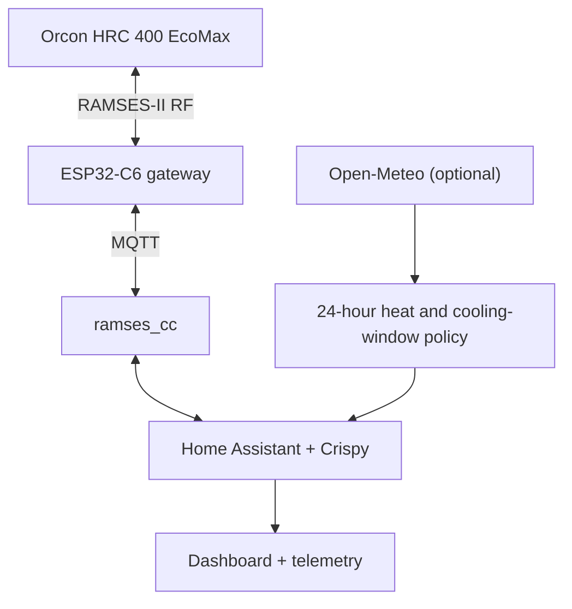
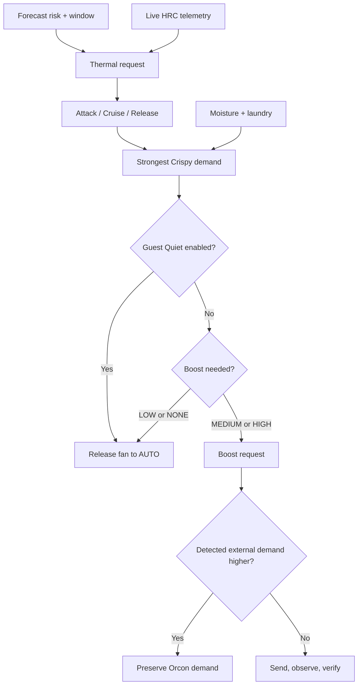
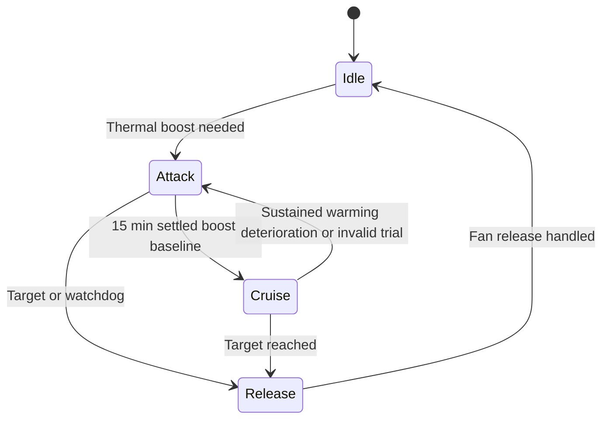

# ❄️ Crispy

> Because apparently “outside colder than inside” needed a supervisory control system.

Crispy is an opinionated Home Assistant controller for an **Orcon HRC 400 EcoMax** connected through **RAMSES-II RF**, **MQTT**, `ramses_cc`, and an ESP32-C6 sub-GHz gateway.

It adds three demand engines on top of the Orcon:

- free cooling from colder intake air;
- moisture removal when intake air is genuinely drier;
- an optional laundry-drying cycle.

The Orcon remains the base controller. Automatic fan control only requests `MEDIUM`, `HIGH`, or releases Crispy's remote to `AUTO`; it never forces `LOW`. Bypass control is independent. This leaves native ventilation demand in charge whenever no boost is needed. Commissioned fan calibration and balancing remain untouched. An explicit manual LOW control remains available in advanced controls.

**[Open the real Crispy dashboard capture](./crispy-dashboard-example.pdf)**

## Architecture



Forecasts can lower the target and increase fan aggression, but they never bypass the live safety gates. Intake and supply telemetry retain final authority over whether free cooling is actually useful.

## Decision model

Crispy calculates independent thermal, moisture, and laundry demand. Thermal demand combines the live temperature ladder, momentum, recent heat gain, and the rolling forecast. Auto then moves through explicit Attack, Cruise, and Release phases.



Higher demand is immediate. HIGH→MEDIUM reductions retain the 12-minute dwell except near target, in Cruise, or during watchdog reductions. LOW/NONE demand and Guest Quiet release Crispy's fan override to `AUTO` immediately. AUTO is native authority, not a fixed speed: humidity/CO₂ control may still run the fans higher. Useful thermal demand can keep bypass OPEN independently of fan AUTO.

### Thermal demand

Thermal cooling requires Crispy to be enabled, critical telemetry to be healthy, intake temperature to remain above the configured cold-intake guard, indoor temperature to be above target, and intake air to be cooler than indoor air.

| Indoor − intake | Base demand |
|---:|:---|
| `< 0.5°C` | None |
| `0.5–<1.0°C` | Low internal demand → fan AUTO, bypass OPEN |
| `1.0–<3.0°C` | Medium |
| `≥ 3.0°C` | High |

Momentum inputs must remain plausible for five minutes after startup; another ten minutes of sustained warming then arms thermal pressure. Warming pressure can step the base request up once, while genuine cooling suppresses it. Recent heat gain provides separate two-hour memory. **Full Send** requests High whenever the apartment is above target and intake air is slightly cooler; it never enters Cruise.

### Forecasts and AUTO trials

In **Auto**, thermal boosts restart at target +0.3°C and release at target. Within 0.5°C of target, thermal demand is capped at Medium; useful bypass cooling can continue with the fan in AUTO. Moisture/laundry boosts are independent. Full Send retains its explicit High-until-target behaviour.

Forecast urgency requires **high/extreme risk, heat within six hours, and a real closing boundary within four hours**; within two hours and ≥0.5°C above target it requests High. Low risk never adds predictive demand. Ties are attributed to live demand.

Forecast intervals use sorted timestamps. Missing temperatures, duplicate times and gaps cannot fabricate a closing deadline. “Open through 18h” means no end was found, not 18h left. Windows are evaluated against the user target and cold-intake guard. Intake correction is bounded to ±3°C, decays to zero over three hours, and positive correction stops at sunset. These are conservative estimates, not a calibrated building model.

**Forecast precooling is opt-in.** High/extreme risk can lower the target by 0.5/1°C only ahead of heat within six hours, with a closing cooling window and no better opportunity forecast before the heat. The comfort floor defaults to 18°C and also bounds manual Heatwave's offset; it never raises a user's lower target.



Cruise always tests **native AUTO**, without a minimum-wattage requirement. It waits 15 minutes after release before evaluating the 15-minute temperature rate. Warming above +0.10°C/h and ≥0.15°C/h worse than the boost baseline for five minutes returns to Attack. A flat room under solar load is success. Intake shifts ≥1.5°C, lost delivery, or independent boosts invalidate the comparison. Failed/invalid trials wait 45 minutes before qualifying again; intake improving by 2°C for five minutes clears the cooldown early. Trials restart after HA startup rather than reuse an old baseline.

This compares observed temperature trends, not measured incremental fan efficiency: clouds, occupants and native ventilation can still affect the result. Total cooling watts remain informational. The dashboard and snapshot show trial settling, baseline, retry state, and whether demand is present cooling, observed warming, or forecast precooling.

The watchdog allows five minutes of continuous open-bypass Attack to settle, then requires three minutes of supply at/above room temperature or negligible airflow (≤5 L/s). A flat or rising room and low wattage alone never trip it. Retry normally waits ten minutes, but intake ≥1°C colder than at failure for two minutes ends the wait early if live cooling/guard conditions allow it. Thermal cooling opens the bypass; standalone moisture or laundry demand leaves it in Auto and remains allowed during a thermal lockout.

Every meaningful phase, fan, bypass, forecast, or reason change is written to `input_text.crispy_decision_trace` and the Home Assistant Logbook.

If bypass OPEN stays unconfirmed for three minutes while supply is no cooler (or airflow is negligible), the same thermal retry timer stops the boost. `input_text.crispy_watchdog_reason` distinguishes bypass failure from failed cooling through an open bypass. Moisture/laundry and detected external demand remain independently eligible.

Forecast influence expires 90 minutes after the last accepted fetch, or sooner when no numeric forecast point remains in the next hour. Predictive target offsets and aggression fall back to live control; manual Heatwave still works. The dashboard shows freshness and the accepted-fetch timestamp. Cached forecast graphs remain visible. This checks fetch age and time coverage, not the provider's internal model age.

Telemetry age uses `last_reported` on the five original RAMSES source entities, not changes to template aliases. Unchanged values can stay fresh. This measures integration reporting; it cannot independently detect an integration repeatedly publishing cached RF data. Keep each adapter's `source_entity` mapped to its actual source. [Home Assistant timestamp semantics](https://www.home-assistant.io/docs/configuration/state_object/).

Tap **Capture diagnostic snapshot** to create a copyable Home Assistant notification with temperatures, trends, demand, ownership, bypass/retry state, forecast freshness, and the latest command/decision. It captures values at tap time and replaces the previous snapshot; use Logbook for earlier decisions. It sends no RF commands or external messages.

### Moisture and laundry

Moisture control compares absolute humidity rather than relative humidity alone. It latches on when indoor RH is at least 60% or rising quickly, provided intake air is usefully drier. It releases when the drying advantage disappears or indoor RH has returned to 55% and stabilised.

Laundry mode records the starting absolute humidity and ventilates according to drying advantage. A rise of 0.5 g/m³ confirms that a wet load was seen; after that, the mode completes when humidity returns close to baseline and remains stable.

## Guest Quiet

`input_boolean.crispy_quiet_mode` suppresses Crispy fan boosts for having people over:

- dashboard shortcuts run it for 2, 4, or 6 hours, then restore normal policy;
- tapping the main Guest Quiet control starts four hours by default; tapping again cancels it;
- Crispy still calculates and exposes the uncapped demand;
- every Crispy fan override—thermal, moisture, laundry, or Full Send—is released to AUTO immediately;
- thermal cooling may still keep the bypass open, so useful cold air is not thrown away;
- native ventilation demand remains in control and can still raise fan speed;
- `script.crispy_max` turns Guest Quiet off before engaging Full Send.

Directly toggling the helper remains an indefinite mode. Timed sessions survive a Home Assistant restart; startup reconciliation also clears a session that expired while Home Assistant was offline.

Guest Quiet cannot guarantee silence: native demand may require more ventilation. It suppresses Crispy's extra drying/cooling boost, which may slow those jobs.

## Failure behaviour

Crispy is designed to fail boring:

- missing or stale critical telemetry marks the controller unhealthy;
- missing forecast data disables predictive influence without blocking live control;
- implausible or newly restarted derivative data cannot arm momentum pressure;
- intake below the configured guard stops Crispy control;
- sustained absent delivered cooling trips a retry timer, with an early retry when intake improves;
- fault, frost, or disabled states return a Crispy-forced bypass to Auto;
- ended, disabled, faulted, or no-longer-useful demand sends fan `AUTO`, returning authority immediately;
- fan commands are checked against reported HRC state and retried once;
- higher external demand is latched and preserved until the HRC steps back down.

## Repository layout

| Path | Purpose |
|---|---|
| `packages/crispy.yaml` | Core helpers, derived telemetry, demand engines, arbitration, RF scripts, and controller |
| `packages/crispy_weather.yaml` | Optional 30-minute forecast fetch, rolling heat risk, target offset, and cooling-window policy |
| `dashboards/crispy_dashboard.yaml` | Optional Home Assistant dashboard; requires Mushroom cards |
| `crispy-dashboard-example.pdf` | Capture of the running dashboard |

## Requirements

- Home Assistant with packages enabled
- MQTT
- [`ramses_cc`](https://github.com/ramses-rf/ramses_cc)
- a compatible RAMSES-II RF gateway
- an Orcon HRC and a verified, bound virtual remote
- Open-Meteo for forecast cards (optional)
- Mushroom cards for the supplied dashboard (optional)

Tested hardware uses the [Elecram ESP32-C6 855–925 MHz bridge](https://elecram.com/products/esp32-c6-wifi-zigbee-to-855-925mhz-wireless).

## Installation

1. Get the HRC visible in `ramses_cc` and verify `low_60`, `medium_60`, `high_60`, `auto`, `bypass_open`, and `bypass_auto` manually.
2. Create these two Home Assistant helpers, which are intentionally expected rather than declared by the package:
   - `input_boolean.crispy_mode`
   - `input_number.crispy_target`
3. Copy `packages/crispy.yaml` into your packages directory.
4. Optionally copy `packages/crispy_weather.yaml` and the dashboard.
5. Map the installation-specific entities in the adapter blocks below.
6. Restart Home Assistant with Crispy **off**, validate every sensor and command, then enable it.

### Register fan AUTO on an Orcon remote

For startup registration of all 21 example commands, use
[`examples/register_crispy_commands.yaml`](examples/register_crispy_commands.yaml)
in the automation YAML editor. Edit the three device variables for your installation.
Run its actions once after saving; registration does not transmit RF.

A remote with only `low_60`, `medium_60`, `high_60` and `bypass_auto` cannot
release the fan: **fan `auto` is a separate command**. Crispy checks for a
registered `auto` command (or an advertised strategy mode), blocks new timed
boosts when it is missing, and posts a notification. Command availability does
not verify packet correctness or RF delivery.

For the example installation, run this in **Developer Tools → Actions → YAML**.
Use your own bound remote and HRC IDs if they differ:

```yaml
action: ramses_cc.add_command
target:
  entity_id: remote.rem_37_099999
data:
  command: auto
  packet_string: "I --- 37:099999 32:142350 --:------ 22F1 003 000407"
```

This registers the command without transmitting it. The `000407` payload is
Orcon AUTO (`04`, maximum mode `07`), as recorded in the
[upstream Orcon packet fixtures](https://github.com/ramses-rf/ramses_rf/blob/master/tests/tests_rf/data_driven/parsers/code_22f1.log).
`auto_alt` is a different mode and is not used here.

To test the handoff, turn Crispy off so it cannot renew a boost, then run:

```yaml
action: script.crispy_send_fan_auto
```

Check the script trace for errors, the remote's `commands` attribute for `auto`,
and fresh HRC telemetry for the timer clearing and native control resuming.
The current script uses a zero remaining timer to clear ownership; **this is a
heuristic, not a protocol acknowledgement**. A fan that remains fast can still
be responding to native demand. Verify the handoff on your hardware before
re-enabling Crispy. Dismiss the missing-command notification after resolving it.

Example package loading:

```yaml
homeassistant:
  packages: !include_dir_named packages
```

### Installation-specific references

| Configuration point | Replace with |
|---|---|
| `INSTALLATION ADAPTER` in `packages/crispy.yaml` | Your HRC temperature, humidity, flow, fan, filter, and bypass entities |
| `input_text.crispy_remote_entity` initial value | Your bound virtual remote |
| `input_text.crispy_weather_entity` initial value | Your weather entity, if using forecasts |
| Weather card in `dashboards/crispy_dashboard.yaml` | The same weather entity; Lovelace entity fields are not templated |

The HRC entity called `outdoor_temperature` is treated by Crispy as **intake temperature at the unit**, not a perfect ambient outdoor reading.

## Control modes

| Control | Effect |
|---|---|
| Crispy Mode | Enables or releases the supervisory controller |
| Auto | Uses predictive Attack/Cruise/Release control |
| Full Send | Requests High whenever useful colder intake air is available |
| Predictive | Uses the rolling 24-hour heat risk and cooling window; safely falls back when unavailable |
| Guest Quiet | Releases Crispy-originated boosts to native AUTO; dashboard presets run 2/4/6 hours |
| Heatwave | Manually lowers the target by 0.5°C; the strongest manual/forecast offset wins |
| Laundry | Runs the humidity-baseline drying lifecycle |
| MAX CRISPY | Target 19°C, Guest Quiet off, Heatwave off, Full Send on |
| NORMAL | Disables Crispy and returns fan and bypass control to the Orcon |

## Cooling telemetry

Delivered sensible cooling is estimated as:

```text
P ≈ 1.2 × airflow[L/s] × (T_indoor − T_supply)
```

This powers the live cooling estimate, accumulated cooling energy, session progress, equivalent AC runtime, and forecast opportunity cards. These are engineering estimates, not calibrated energy measurements.

## Boundaries

This is a personal experimental controller, not an official Orcon product, certified HVAC controller, or universal integration. It was built and tested on one installation.

Keep the manufacturer controller underneath it, validate every mapped entity and RF command, and only transmit to equipment you own or are authorised to control. RAMSES IDs are identifiers, not credentials; protect MQTT, Wi-Fi, Home Assistant, and API secrets normally.

If the telemetry makes no sense: turn Crispy off. The house should become less smart, not more exciting.

## License

[MIT](./LICENSE)
