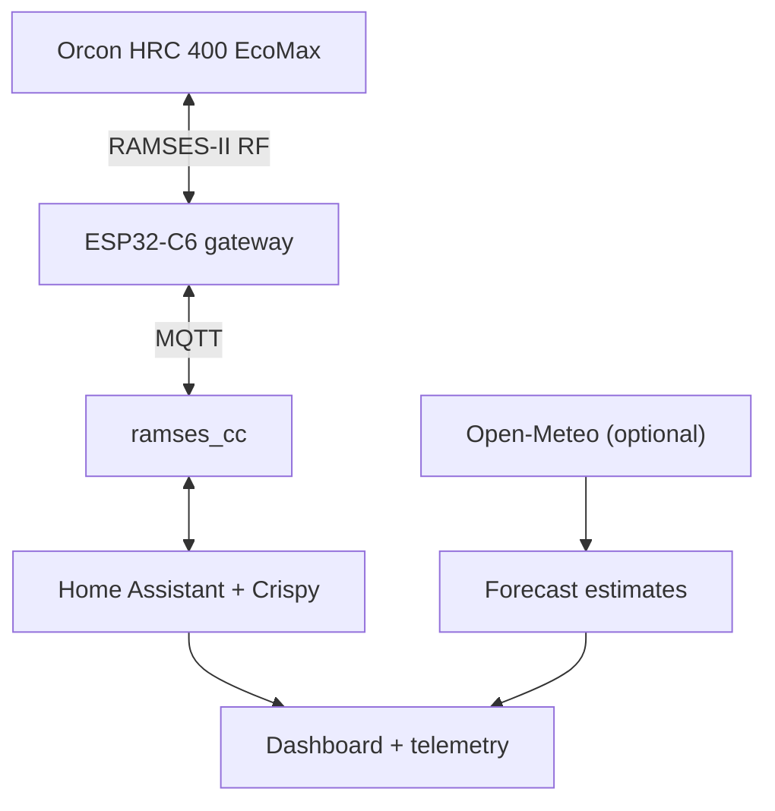
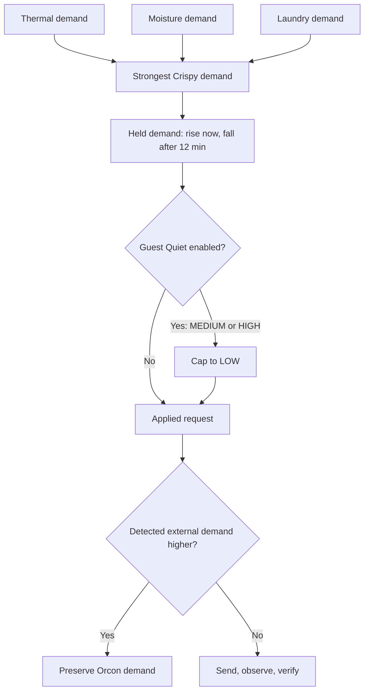

# ❄️ Crispy

> Because apparently “outside colder than inside” needed a supervisory control system.

Crispy is an opinionated Home Assistant controller for an **Orcon HRC 400 EcoMax** connected through **RAMSES-II RF**, **MQTT**, `ramses_cc`, and an ESP32-C6 sub-GHz gateway.

It adds three demand engines on top of the Orcon:

- free cooling from colder intake air;
- moisture removal when intake air is genuinely drier;
- an optional laundry-drying cycle.

The Orcon remains the base controller. Crispy only sends the existing `LOW`, `MEDIUM`, `HIGH`, `BYPASS OPEN`, and `BYPASS AUTO` commands. It does not alter commissioned fan calibration or ventilation balancing, and a detected higher native or physical-control demand is preserved.

**[Open the real Crispy dashboard capture](./crispy-dashboard-example.pdf)**

## Architecture



The forecast layer is deliberately **advisory**. It estimates the overnight cooling window and potential for the dashboard, but it does not currently drive fan or bypass decisions. Live HRC telemetry drives the controller.

## Decision model

Crispy first calculates independent thermal, moisture, and laundry demand. The strongest demand becomes the raw request, after which smoothing, policy, and external-demand arbitration are applied.



Higher demand is applied immediately. Lower demand must remain lower for 12 minutes, preventing RF chatter and fan hunting; disabling Crispy clears the held demand immediately. Guest Quiet is evaluated afterward, so its noise cap is instant.

### Thermal demand

Thermal cooling requires Crispy to be enabled, critical telemetry to be healthy, intake temperature to remain above the configured cold-intake guard, indoor temperature to be above target, and intake air to be cooler than indoor air.

| Indoor − intake | Base demand |
|---:|:---|
| `< 0.5°C` | None |
| `0.5–<1.0°C` | Low |
| `1.0–<3.0°C` | Medium |
| `≥ 3.0°C` | High |

Momentum inputs must remain plausible for five minutes after startup; another ten minutes of sustained warming then arms thermal pressure. This fills the 15-minute derivative window before a new boost can act. While armed, warming or stable pressure steps the base demand up once (`Low → Medium`, `Medium → High`); fast warming requests High, and genuine cooling suppresses the boost. `sensor.crispy_momentum_diagnostic` reports learning, blocked, arming, active, and cooling states. Recent heat gain provides a separate two-hour memory. **Full Send** requests High whenever the apartment is above target and intake air is at least slightly cooler. Thermal demand opens the bypass; moisture-only and laundry-only demand leave bypass control in Auto.

### Moisture and laundry

Moisture control compares absolute humidity rather than relative humidity alone. It latches on when indoor RH is at least 60% or rising quickly, provided intake air is usefully drier. It releases when the drying advantage disappears or indoor RH has returned to 55% and stabilised.

Laundry mode records the starting absolute humidity and ventilates according to drying advantage. A rise of 0.5 g/m³ confirms that a wet load was seen; after that, the mode completes when humidity returns close to baseline and remains stable.

## Guest Quiet

`input_boolean.crispy_quiet_mode` is a real noise cap for having people over:

- dashboard shortcuts run it for 2, 4, or 6 hours, then restore normal policy;
- tapping the main Guest Quiet control starts four hours by default; tapping again cancels it;
- Crispy still calculates and exposes the uncapped demand;
- every held Crispy-originated Medium or High request—thermal, moisture, laundry, or Full Send—is applied as Low immediately;
- thermal cooling may still keep the bypass open, so useful cold air is not thrown away;
- a detected higher request from the Orcon or a physical remote still wins;
- `script.crispy_max` turns Guest Quiet off before engaging Full Send.

Directly toggling the helper remains an indefinite mode. Timed sessions survive a Home Assistant restart; startup reconciliation also clears a session that expired while Home Assistant was offline.

Guest Quiet is a comfort mode, not a humidity strategy. Leaving it enabled will make moisture removal and laundry drying slower. That is the trade: guests can hear each other; the towels lose the drag race.

## Failure behaviour

Crispy is designed to fail boring:

- missing or stale critical telemetry marks the controller unhealthy;
- implausible or newly restarted derivative data cannot arm momentum pressure;
- intake below the configured guard stops Crispy control;
- fault, frost, or disabled states return a Crispy-forced bypass to Auto;
- temporary fan commands are no longer renewed, so the Orcon resumes normal authority;
- fan commands are checked against reported HRC state and retried once;
- higher external demand is latched and preserved until the HRC steps back down.

## Repository layout

| Path | Purpose |
|---|---|
| `packages/crispy.yaml` | Core helpers, derived telemetry, demand engines, arbitration, RF scripts, and controller |
| `packages/crispy_weather.yaml` | Optional 30-minute Open-Meteo forecast fetch and advisory cooling estimates |
| `dashboards/crispy_dashboard.yaml` | Optional Home Assistant dashboard; requires Mushroom cards |
| `crispy-dashboard-example.pdf` | Capture of the running dashboard |

## Requirements

- Home Assistant with packages enabled
- MQTT
- [`ramses_cc`](https://github.com/ramses-rf/ramses_cc)
- a compatible RAMSES-II RF gateway
- an Orcon HRC and a verified, bound virtual remote
- Open-Meteo for forecast cards (optional)
- Mushroom cards for the supplied dashboard (optional)

Tested hardware uses the [Elecram ESP32-C6 855–925 MHz bridge](https://elecram.com/products/esp32-c6-wifi-zigbee-to-855-925mhz-wireless).

## Installation

1. Get the HRC visible in `ramses_cc` and verify `low_60`, `medium_60`, `high_60`, `bypass_open`, and `bypass_auto` manually.
2. Create these two Home Assistant helpers, which are intentionally expected rather than declared by the package:
   - `input_boolean.crispy_mode`
   - `input_number.crispy_target`
3. Copy `packages/crispy.yaml` into your packages directory.
4. Optionally copy `packages/crispy_weather.yaml` and the dashboard.
5. Replace the installation-specific entity IDs below.
6. Restart Home Assistant with Crispy **off**, validate every sensor and command, then enable it.

Example package loading:

```yaml
homeassistant:
  packages: !include_dir_named packages
```

### Installation-specific references

| Reference in this repo | Replace with |
|---|---|
| `sensor.fan_32_142350_*` | Your HRC telemetry entities |
| `binary_sensor.fan_32_142350_bypass_position` | Your reported bypass state |
| `remote.rem_37_099999` | Your bound virtual remote |
| `weather.forecast_thuis` | Your weather entity, if using forecasts |

The HRC entity called `outdoor_temperature` is treated by Crispy as **intake temperature at the unit**, not a perfect ambient outdoor reading.

## Control modes

| Control | Effect |
|---|---|
| Crispy Mode | Enables or releases the supervisory controller |
| Auto | Uses the normal thermal demand ladder and escalation logic |
| Full Send | Requests High whenever useful colder intake air is available |
| Guest Quiet | Caps Crispy-originated demand at Low; dashboard presets run 2/4/6 hours |
| Heatwave | Lowers the effective target by 0.5°C |
| Laundry | Runs the humidity-baseline drying lifecycle |
| MAX CRISPY | Target 19°C, Guest Quiet off, Heatwave off, Full Send on |
| NORMAL | Disables Crispy and returns bypass control to the Orcon |

## Cooling telemetry

Delivered sensible cooling is estimated as:

```text
P ≈ 1.2 × airflow[L/s] × (T_indoor − T_supply)
```

This powers the live cooling estimate, accumulated cooling energy, session progress, equivalent AC runtime, and forecast opportunity cards. These are engineering estimates, not calibrated energy measurements.

## Boundaries

This is a personal experimental controller, not an official Orcon product, certified HVAC controller, or universal integration. It was built and tested on one installation.

Keep the manufacturer controller underneath it, validate every mapped entity and RF command, and only transmit to equipment you own or are authorised to control. RAMSES IDs are identifiers, not credentials; protect MQTT, Wi-Fi, Home Assistant, and API secrets normally.

If the telemetry makes no sense: turn Crispy off. The house should become less smart, not more exciting.

## License

[MIT](./LICENSE)
